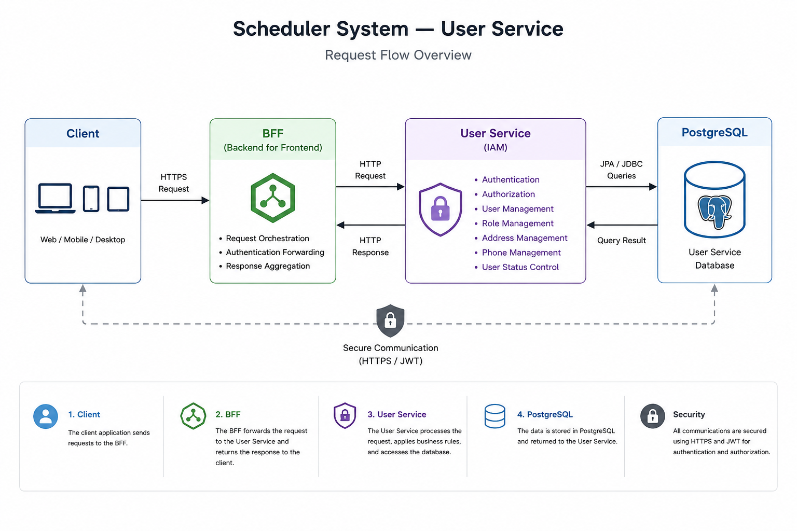

# Scheduler System - User Service

**Identity and Access Management (IAM) microservice for the Scheduler System platform.**

The User Service provides a secure and scalable authentication and authorization layer for the Scheduler System platform, implementing Role-Based Access Control (RBAC) with Spring Security and JWT Authentication.

<div align="center">

[](https://github.com/geisivanvitena/scheduler-user-service/actions/workflows/gradle.yml)
[](https://sonarcloud.io/summary/new_code?id=geisivanvitena_scheduler-user-service)
[](https://sonarcloud.io/summary/new_code?id=geisivanvitena_scheduler-user-service)
[](https://github.com/geisivanvitena/scheduler-user-service/blob/main/LICENSE)

</div>

<div align="center">

[](https://www.oracle.com/java/)
[](https://spring.io/projects/spring-boot)
[](https://www.postgresql.org/)
[](https://gradle.org/)

</div>

---

## Summary

- [About the Project](#about-the-project)
- [Platform Architecture](#platform-architecture)
- [User Service Architecture](#user-service-architecture)
- [Features](#features)
- [Security Architecture](#security-architecture)
- [Package Structure](#package-structure)
- [Endpoints](#endpoints)
- [API Request Examples](#api-request-examples)
- [Technologies Used](#technologies-used)
- [How to Run the Project](#how-to-run-the-project)
- [API Documentation](#api-documentation)
- [Tests and Coverage](#tests-and-coverage)
- [Code Quality Analysis](#code-quality-analysis)
- [CI/CD Pipeline](#cicd-pipeline)
- [Roadmap](#roadmap)
- [License](#license)
- [Author](#author)

---

## About the Project

The **User Service** is the **Identity and Access Management (IAM)** component of the **Scheduler System platform.**

Responsibilities:

- User registration
- Authentication and authorization
- User profile management
- Address management
- Phone management
- Administrative user operations

Authentication and authorization are implemented using **Spring Security** and **JWT Authentication**, ensuring secure access to protected resources through **Role-Based Access Control (RBAC)**.

The service was designed following **RESTful API principles** and is part of a microservices architecture where each service owns a specific business domain.

The application follows a layered architecture inspired by Clean Architecture concepts, promoting separation of responsibilities between controllers, application services, domain entities, repositories, and infrastructure components.

---

## Platform Architecture

The Scheduler System follows a **microservices architecture** where each service is responsible for a specific business domain.

Services can be developed, deployed, scaled, and maintained independently, improving flexibility, scalability, and system reliability.

### Services

- **BFF (Backend for Frontend)** – Centralizes requests and orchestrates communication between clients and microservices
- **User Service** – Identity and Access Management (IAM)
- **Task Service** – Task management and scheduling
- **Notification Service** – Email notification delivery

---

## User Service Architecture

<div align="center">



</div>

### Request Flow:

1. Client sends a request
2. BFF forwards the request to the User Service
3. Spring Security validates authentication and authorization
4. Business rules are executed
5. Data is persisted in PostgreSQL
6. Response is returned to the BFF
7. BFF returns the response to the client

---

## Features

- JWT Authentication
- Role-Based Access Control (RBAC)
- User Profile Management
- Address Management
- Phone Management
- Administrative User Management
- Pagination and filtering for administrative users
- API documentation with Swagger/OpenAPI
- Continuous code quality analysis with SonarQube

---

## Security Architecture

The User Service uses **Spring Security** with **JWT Authentication** to protect API resources and enforce authorization rules.

The security implementation follows a **stateless authentication architecture**, meaning the server does not maintain user sessions.

Every protected request must contain a valid JWT token using the Bearer authentication scheme.

Example:

```http
Authorization: Bearer <JWT_TOKEN>
```

---

### Security Features

The security layer provides:

- JWT-based authentication
- Role-Based Access Control (RBAC)
- Stateless session management
- BCrypt password hashing
- Protected API endpoints
- Custom authentication handling
- Custom authorization handling

CSRF protection is disabled because the application follows a stateless REST API architecture using JWT authentication.

---

### Security Components

The security layer is composed of the following components:

| Component                      | Responsibility                                                                    |
|--------------------------------|-----------------------------------------------------------------------------------|
| Spring Security                | Provides authentication and authorization mechanisms for protecting API endpoints |
| JWT Authentication             | Enables stateless authentication using JSON Web Tokens (JWT)                      |
| JwtRequestFilter               | Intercepts incoming requests and validates JWT tokens before granting access      |
| UserDetailsServiceImpl         | Loads user information and assigned roles during authentication                   |
| CustomAuthenticationEntryPoint | Handles unauthenticated requests and returns HTTP 401 Unauthorized                |
| CustomAccessDeniedHandler      | Handles authorization failures and returns HTTP 403 Forbidden                     |

---

## Package Structure

The User Service follows a layered architecture inspired by **Clean Architecture concepts**, separating responsibilities between API interfaces, application logic, domain models, and infrastructure components.

```text
com.geisivan.userservice/
│
│
├── application/
│   │ 
│   ├── dto/
│   ├── mapper/
│   ├── service/
│   └── validator/
│
├── controller/
│
├── domain/
│
└── infrastructure/
    │ 
    ├── config/
    ├── exception/
    ├── handler/
    ├── repository/
    └── security/
```

### Layer Responsibilities

| Layer          | Responsibility                                                                          |
|----------------|-----------------------------------------------------------------------------------------|
| Controller     | Exposes REST API endpoints and handles HTTP requests                                    |
| Application    | Contains business use cases, DTOs, validators, and service logic                        |
| Domain         | Contains business entities, enums, and core domain rules                                |
| Infrastructure | Contains database access, security configuration, exceptions, and external integrations |

---

## Endpoints

Protected endpoints require a valid JWT token using the Bearer authentication scheme.

Example:

```http
Authorization: Bearer <JWT_TOKEN>
```

---

### Public Endpoints 🔓

No authentication required.

| Method | Endpoint                | Authentication | Description                              |
|--------|-------------------------|----------------|------------------------------------------|
| POST   | `/api/v1/auth/register` | public         | Register a new user                      |
| POST   | `/api/v1/auth/login`    | public         | Authenticate user and generate JWT token |

---

### User Profile Endpoints 🔒

Manage the authenticated user's profile.

**Required Role:** `ROLE_USER`

| Method | Endpoint           | Authentication | Description                           |
|--------|--------------------|----------------|---------------------------------------|
| GET    | `/api/v1/users/me` | ✅ JWT         | Retrieve authenticated user's profile |
| PUT    | `/api/v1/users/me` | ✅ JWT         | Update authenticated user's profile   |
| DELETE | `/api/v1/users/me` | ✅ JWT         | Delete authenticated user's account   |

---

### Address Endpoints 🔒

Manage the authenticated user's addresses.

**Required Role:** `ROLE_USER`

| Method | Endpoint                          | Authentication | Description                             |
|--------|-----------------------------------|----------------|-----------------------------------------|
| POST   | `/api/v1/users/me/addresses`      | ✅ JWT         | Create a new address                    |
| GET    | `/api/v1/users/me/addresses`      | ✅ JWT         | Retrieve authenticated user's addresses |
| PUT    | `/api/v1/users/me/addresses/{id}` | ✅ JWT         | Update an existing address              |
| DELETE | `/api/v1/users/me/addresses/{id}` | ✅ JWT         | Delete an address                       |

---

### Phone Endpoints 🔒

Manage the authenticated user's phone numbers.

**Required Role:** `ROLE_USER`

| Method | Endpoint                       | Authentication | Description                                   |
|--------|--------------------------------|----------------|-----------------------------------------------|
| POST   | `/api/v1/users/me/phones`      | ✅ JWT         | Create a new phone number                     |
| GET    | `/api/v1/users/me/phones`      | ✅ JWT         | Retrieve authenticated user's phone numbers   |
| PUT    | `/api/v1/users/me/phones/{id}` | ✅ JWT         | Update a phone number                         |
| DELETE | `/api/v1/users/me/phones/{id}` | ✅ JWT         | Delete a phone number                         |

---

### Administrative Endpoints 🔒

Administrative operations for user management.

**Required Role:** `ROLE_ADMIN`

| Method | Endpoint                                           | Authentication | Description                                         |
|--------|----------------------------------------------------|----------------|-----------------------------------------------------|
| POST   | `/api/v1/admin/users`                              | ✅ JWT         | Create a new user                                   |
| GET    | `/api/v1/admin/users`                              | ✅ JWT         | Retrieve users with optional filters and pagination |
| GET    | `/api/v1/admin/users/{id}`                         | ✅ JWT         | Retrieve user by ID                                 |
| GET    | `/api/v1/admin/users/email?email=user@example.com` | ✅ JWT         | Retrieve user by email                              |
| PUT    | `/api/v1/admin/users/{id}`                         | ✅ JWT         | Update user information                             |
| PATCH  | `/api/v1/admin/users/{id}/status`                  | ✅ JWT         | Update user status                                  |
| PATCH  | `/api/v1/admin/users/{id}/roles`                   | ✅ JWT         | Update user roles                                   |
| DELETE | `/api/v1/admin/users/{id}`                         | ✅ JWT         | Delete user                                         |

---

## API Request Examples

### User Registration

**Endpoint:**

```http
POST /api/v1/auth/register
```

**Request:**

```json
{
    "name": "user test",
    "email": "user@example.com",
    "password": "123456"
}
```

**Response:**

```json
{
    "id": 7,
    "name": "user test",
    "email": "user@example.com",
    "status": "ACTIVE",
    "roles": [
      {
        "id": 2,
        "name": "ROLE_USER",
        "description": "Standard user role with limited access"
      }
    ],
    "addresses": [],
    "phones": [],
    "createdAt": "2026-08-02T21:58:54.508014Z",
    "updatedAt": "2026-08-02T21:58:54.508014Z"
}
```
---

### User Authentication

**Endpoint:**

```http
POST /api/v1/auth/login
```

**Request:**

```json
{
    "email": "user@example.com",
    "password": "123456"
}
```

**Response:**

```json
{ 
   "token": "jwt-token", 
   "type": "Bearer",
   "userId": 7,
   "email": "user@example.com"
}
```

---

### Get Authenticated User

**Endpoint:**

```http
GET /api/v1/users/me
```

**Headers:**

Authorization: Bearer <jwt-token>

**Response:**

```json
{
    "id": 7,
    "name": "user test",
    "email": "user@example.com",
    "status": "ACTIVE",
    "roles": [
     {
        "id": 2,
        "name": "ROLE_USER",
        "description": "Standard user role with limited access"
     }
    ],
    "addresses": [],
    "phones": [],
    "createdAt": "2026-08-02T21:58:54.508014Z",
    "updatedAt": "2026-08-02T21:58:54.508014Z"
}
```

---

## Technologies Used

### Backend stack

| Technology         | Purpose                          |
|--------------------|----------------------------------|
| Java 17            | Main programming language        |
| Spring Boot 3.5.16 | Application framework            |
| Spring Security    | Authentication and authorization |
| JWT                | Stateless authentication         |
| Spring Data JPA    | Database persistence             |
| PostgreSQL         | Relational database              |
| Gradle             | Build automation                 |

### Testing & Quality

| Technology | Purpose              |
|------------|----------------------|
| JUnit 5    | Unit testing         |
| Mockito    | Mocking dependencies |
| JaCoCo     | Code coverage        |
| SonarQube  | Static code analysis |

### Documentation

| Technology        | Purpose                        |
|-------------------|--------------------------------|
| Swagger / OpenAPI | Interactive API documentation  |

---

## How to Run the Project

### Prerequisites

⚠️ **Important**: Before running the application, ensure that the following software is installed on your machine:

- Java 17
- PostgreSQL

---

### Clone the Repository

```bash
# Clone the repository
git clone https://github.com/geisivanvitena/scheduler-user-service.git

# Navigate to the project directory
cd scheduler-user-service
```

---

### Configure Environment Variables

```env
# JWT Configuration
JWT_SECRET=your-secret-key
JWT_EXPIRATION_MS=3600000

# PostgreSQL Configuration
DB_HOST=host
DB_PORT=port
POSTGRES_DB=your-db
POSTGRES_USER=your-user
POSTGRES_PASSWORD=your-database-password
```

⚠️ **Important**: Never commit .env files containing sensitive information.

---

### Run the Application

⚠️ **Important**: Make sure PostgreSQL is running and accessible on the local host.

**Build the project**

```bash
./gradlew clean build
```

**Start the application**

```bash
./gradlew bootRun
```

**The application will be available at:**

```text
http://localhost:8080
```

---

## API Documentation

### Swagger UI is available at:

```text
http://localhost:8080/swagger-ui/index.html
```

Features:

- Interactive API exploration
- Request execution directly from the browser
- Request and response schemas
- JWT authentication support

---

## Tests and Coverage

The project includes automated tests covering:

- Controllers
- Services
- Validators
- Security components
- Business rules

Testing Stack:

- JUnit 5
- Mockito
- JaCoCo
- SonarQube

| Application Class      | What is Tested                        | Test Class                |
|------------------------|---------------------------------------|---------------------------|
| `AuthController`       | Authentication endpoints              | `AuthControllerTest`      |
| `AuthService`          | Authentication business rules         | `AuthServiceTest`         |
| `UserController`       | User endpoints                        | `UserControllerTest`      |
| `UserService`          | User business rules                   | `UserServiceTest`         |
| `AdminUserController`  | Administrative endpoints              | `AdminUserControllerTest` |
| `AdminUserService`     | Administrative business rules         | `AdminUserServiceTest`    |
| `AddressController`    | Address endpoints                     | `AddressControllerTest`   |
| `AddressService`       | Address business rules                | `AddressServiceTest`      |
| `PhoneController`      | Phone endpoints                       | `PhoneControllerTest`     |
| `PhoneService`         | Phone business rules                  | `PhoneServiceTest`        |
| `UserValidator`        | Validation rules                      | `UserValidatorTest`       |

💡 _Detailed information about all test scenarios can be found in the `src/test/java` directory._

---

### Run Tests

**Execute tests:**

```bash
./gradlew test
```

**Generate JaCoCo coverage report:**

```bash
./gradlew jacocoTestReport
```

**Coverage report:**

```text
build/reports/jacoco/test/html/index.html
```

---

## Code Quality Analysis

The project uses SonarQube for continuous code quality inspection.

### Quality Overview

[](https://sonarcloud.io/summary/new_code?id=geisivanvitena_scheduler-user-service)
[](https://sonarcloud.io/summary/new_code?id=geisivanvitena_scheduler-user-service)
[](https://sonarcloud.io/summary/new_code?id=geisivanvitena_scheduler-user-service)
[](https://sonarcloud.io/summary/new_code?id=geisivanvitena_scheduler-user-service)
[](https://sonarcloud.io/summary/new_code?id=geisivanvitena_scheduler-user-service)

### Code Quality Metrics

[](https://sonarcloud.io/summary/new_code?id=geisivanvitena_scheduler-user-service)
[](https://sonarcloud.io/summary/new_code?id=geisivanvitena_scheduler-user-service)
[](https://sonarcloud.io/summary/new_code?id=geisivanvitena_scheduler-user-service)
[](https://sonarcloud.io/summary/new_code?id=geisivanvitena_scheduler-user-service)
[](https://sonarcloud.io/summary/new_code?id=geisivanvitena_scheduler-user-service)
[](https://sonarcloud.io/summary/new_code?id=geisivanvitena_scheduler-user-service)

---

## CI/CD Pipeline

The project uses GitHub Actions to automate build, testing, code coverage analysis, and code quality verification.

The pipeline executes the following steps:

1. Checkout source code
2. Configure JDK environment
3. Build the application
4. Execute automated tests
5. Generate JaCoCo coverage reports
6. Analyze code quality with SonarQube
7. Validate SonarQube Quality Gate

The pipeline ensures:

- Code reliability
- Automated validation
- Continuous quality monitoring
- Safer integration of new features

The CI environment uses JDK 21, while the application runtime targets Java 17.

---

## Roadmap

Future improvements planned for the User Service:

### Security

- [ ] Refresh Token implementation
- [ ] Email verification workflow
- [ ] Password recovery workflow

### DevOps

- [ ] Docker containerization
- [ ] Docker Compose
- [ ] Kubernetes deployment
- [ ] AWS deployment

### Platform Evolution

- [ ] Frontend integration
- [ ] Application monitoring
- [ ] Centralized logging
- [ ] Distributed tracing

---

## License

This project is licensed under the MIT License.

See the LICENSE file for more details.

[](https://github.com/geisivanvitena/scheduler-user-service/blob/main/LICENSE)

---

## Author

### Geisivan Vitena

Full Stack Java Developer | Spring Boot | Angular | REST APIs | CI/CD

Contact

[](https://www.linkedin.com/in/geisivan-vitena-a46168246/)

[](https://github.com/geisivanvitena/)

[](mailto:gsv1205@yahoo.com)
