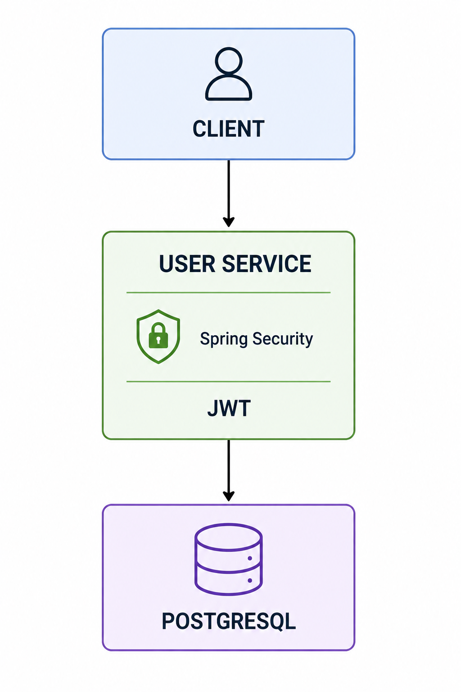

# User Service

**Identity and Access Management (IAM) microservice for the Scheduler System platform.**

The User Service centralizes user management, authentication, and authorization across the Scheduler System ecosystem.

<div align="center">

[](https://github.com/geisivanvitena/scheduler-user-service/actions/workflows/gradle.yml)
[](https://sonarcloud.io/summary/new_code?id=geisivanvitena_scheduler-user-service)
[](https://sonarcloud.io/summary/new_code?id=geisivanvitena_scheduler-user-service)
[](https://github.com/geisivanvitena/scheduler-user-service/blob/main/LICENSE)

</div>

<div align="center">

[](https://www.oracle.com/java/)
[](https://spring.io/projects/spring-boot)
[](https://www.postgresql.org/)
[](https://gradle.org/)

</div>

---

## Summary

- [About the Project](#about-the-project)
- [Platform Architecture](#platform-architecture)
- [User Service Architecture](#user-service-architecture)
- [Features](#features)
- [Package Structure](#package-structure)
- [Endpoints](#endpoints)
- [API Request Examples](#api-request-examples)
- [Technologies Used](#technologies-used)
- [How to Run the Project](#how-to-run-the-project)
- [API Documentation](#api-documentation)
- [Tests and Coverage](#tests-and-coverage)
- [Code Quality Analysis](#code-quality-analysis)
- [CI/CD Pipeline](#cicd-pipeline)
- [Roadmap](#roadmap)
- [License](#license)
- [Author](#author)

---

## About the Project

The User Service is the Identity and Access Management (IAM) component of the Scheduler System platform.

Responsibilities:

- User registration
- Authentication and authorization
- User profile management
- Address management
- Phone management
- Administrative user operations

Authentication and authorization are implemented using Spring Security and JWT Authentication, ensuring secure access to protected resources through Role-Based Access Control (RBAC).

---

## Platform Architecture

The Scheduler System follows a microservices architecture where each service is responsible for a specific business domain.

### Services

- **BFF (Backend for Frontend)** – Centralizes requests and orchestrates communication between clients and microservices
- **User Service** – Identity and Access Management
- **Task Service** – Task management
- **Notification Service** – Email notification delivery

---

## User Service Architecture

<div align="center">



</div>

### Flow:

1. Client sends a request to the User Service
2. Spring Security validates the JWT token and user permissions
3. The User Service processes the business rules
4. Data is persisted or retrieved from PostgreSQL
5. The User Service returns the response to the client

---
## Features

- User registration
- User authentication
- JWT-based authorization
- Role-Based Access Control (RBAC)
- User profile management
- Address management
- Phone management
- Password encryption using BCrypt
- Swagger/OpenAPI documentation
- Automated testing
- CI/CD integration
- Code quality analysis with SonarQube and SonarCloud

---

## Package Structure

```text
com.geisivan.userservice/
│
│
├── application/
│   │ 
│   ├── dto/
│   ├── mapper/
│   ├── service/
│   └── validator/
│
├── controller/
│
├── domain/
│
└── infrastructure/
    │ 
    ├── config/
    ├── exception/
    ├── repository/
    └── security/
```

---

## Endpoints

### Public Endpoints 🔓

| Method | Endpoint                | Authentication | Description                              |
|--------|-------------------------|----------------|------------------------------------------|
| POST   | `/api/v1/auth/register` | public         | Register a new user                      |
| POST   | `/api/v1/auth/login`    | public         | Authenticate user and generate JWT token |

---

### Protected Endpoints 🔒

Protected endpoints require a valid JWT token using the Bearer authentication scheme.

Example:

```http
Authorization: Bearer <JWT_TOKEN>
```

**User Endpoints** 🔒

| Method | Endpoint           | Authentication | Description                           |
|--------|--------------------|----------------|---------------------------------------|
| GET    | `/api/v1/users/me` | ✅ JWT         | Retrieve authenticated user's profile |
| PUT    | `/api/v1/users/me` | ✅ JWT         | Update authenticated user's profile   |
| DELETE | `/api/v1/users/me` | ✅ JWT         | Delete authenticated user's account   |

---

**Address Endpoints** 🔒

| Method | Endpoint                          | Authentication | Description                             |
|--------|-----------------------------------|----------------|-----------------------------------------|
| POST   | `/api/v1/users/me/addresses`      | ✅ JWT         | Create a new address                    |
| GET    | `/api/v1/users/me/addresses`      | ✅ JWT         | Retrieve authenticated user's addresses |
| PUT    | `/api/v1/users/me/addresses/{id}` | ✅ JWT         | Update an existing address              |
| DELETE | `/api/v1/users/me/addresses/{id}` | ✅ JWT         | Delete an address                       |

---

**Phone Endpoints** 🔒

| Method | Endpoint                       | Authentication | Description                                   |
|--------|--------------------------------|----------------|-----------------------------------------------|
| POST   | `/api/v1/users/me/phones`      | ✅ JWT         | Create a new phone number                     |
| GET    | `/api/v1/users/me/phones`      | ✅ JWT         | Retrieve authenticated user's phone numbers   |
| PUT    | `/api/v1/users/me/phones/{id}` | ✅ JWT         | Update a phone number                         |
| DELETE | `/api/v1/users/me/phones/{id}` | ✅ JWT         | Delete a phone number                         |

---

**Administrative Endpoints** 🔒

**Required Role:** `ROLE_ADMIN`

| Method | Endpoint                                           | Authentication | Description                                         |
|--------|----------------------------------------------------|----------------|-----------------------------------------------------|
| POST   | `/api/v1/admin/users`                              | ✅ JWT         | Create a new user                                   |
| GET    | `/api/v1/admin/users`                              | ✅ JWT         | Retrieve users with optional filters and pagination |
| GET    | `/api/v1/admin/users/{id}`                         | ✅ JWT         | Retrieve user by ID                                 |
| GET    | `/api/v1/admin/users/email?email=user@example.com` | ✅ JWT         | Retrieve user by email                              |
| PUT    | `/api/v1/admin/users/{id}`                         | ✅ JWT         | Update user information                             |
| PATCH  | `/api/v1/admin/users/{id}/status`                  | ✅ JWT         | Update user status                                  |
| PATCH  | `/api/v1/admin/users/{id}/roles`                   | ✅ JWT         | Update user roles                                   |
| DELETE | `/api/v1/admin/users/{id}`                         | ✅ JWT         | Delete user                                         |

---

## API Request Examples

### User Registration

**Endpoint**

```http
POST /api/v1/auth/register
```

**Request Example**

```json
{
    "name": "user test",
    "email": "user@example.com",
    "password": "123456"
}
```

**Response Example**

```json
{
    "id": 7,
    "name": "user test",
    "email": "user@example.com",
    "status": "ACTIVE",
    "roles": [
      {
        "id": 2,
        "name": "ROLE_USER",
        "description": "Standard user role with limited access"
      }
    ],
    "addresses": [],
    "phones": [],
    "createdAt": "2026-08-02T21:58:54.508014Z",
    "updatedAt": "2026-08-02T21:58:54.508014Z"
}
```
---

### User Authentication

**Endpoint**

```http
POST /api/v1/auth/login
```

**Request Example**

```json
{
    "email": "user@example.com",
    "password": "123456"
}
```

**Response Example**

```json
{ 
   "token": "jwt-token", 
   "type": "Bearer",
   "userId": 7,
   "email": "user@example.com"
}
```

---

### Get Authenticated User

**Endpoint**

```http
GET /api/v1/users/me
```

**Required Header**

```http
Authorization: Bearer <JWT_TOKEN>
```

**Response Example**

```json
{
    "id": 7,
    "name": "user test",
    "email": "user@example.com",
    "status": "ACTIVE",
    "roles": [
     {
        "id": 2,
        "name": "ROLE_USER",
        "description": "Standard user role with limited access"
     }
    ],
    "addresses": [],
    "phones": [],
    "createdAt": "2026-08-02T21:58:54.508014Z",
    "updatedAt": "2026-08-02T21:58:54.508014Z"
}
```

---

## Technologies Used

| Technology      | Purpose                          |
|-----------------|----------------------------------|
| Java 21 LTS     | Main programming language        |
| Spring Boot 4.x | Application framework            |
| Spring Security | Authentication and authorization |
| JWT             | Stateless authentication         |
| Spring Data JPA | Database persistence             |
| PostgreSQL      | Relational database              |
| Gradle          | Build automation                 |

---

## How to Run the Project

### Prerequisites

- Java 21
- PostgreSQL

---

### Clone the Repository

```bash
# Clone the project

git clone https://github.com/geisivanvitena/scheduler-user-service.git

# Enter the project folder

cd scheduler-user-service
```

---

### Configure Environment Variables

```env
# JWT

JWT_SECRET=your-secret-key
JWT_EXPIRATION_MS=3600000

# PostgreSQL

DB_HOST=host
DB_PORT=port
POSTGRES_DB=your-db
POSTGRES_USER=your-user
POSTGRES_PASSWORD=your-database-password
```

⚠️ **Important:** Never commit .env files containing sensitive information.

---

### Build

```bash
./gradlew clean build
```

### Run

```bash
./gradlew bootRun
```

The application will be available at: `http://localhost:8080`

---

## API Documentation

### Swagger UI:

```text
http://localhost:8080/swagger-ui/index.html
```

**The documentation provides:**

- Endpoint details
- Request schemas
- Response schemas
- Authentication requirements
- Interactive API execution

---

## Tests and Coverage

**Testing Stack:**

- JUnit 5
- Mockito
- JaCoCo
- SonarQube
- SonarCloud

| Application Class      | What is Tested                        | Test Class                |
|------------------------|---------------------------------------|---------------------------|
| `AuthController`       | Authentication endpoints              | `AuthControllerTest`      |
| `AuthService`          | Authentication business rules         | `AuthServiceTest`         |
| `UserController`       | User endpoints                        | `UserControllerTest`      |
| `UserService`          | User business rules                   | `UserServiceTest`         |
| `AdminUserController`  | Administrative endpoints              | `AdminUserControllerTest` |
| `AdminUserService`     | Administrative business rules         | `AdminUserServiceTest`    |
| `AddressController`    | Address endpoints                     | `AddressControllerTest`   |
| `AddressService`       | Address business rules                | `AddressServiceTest`      |
| `PhoneController`      | Phone endpoints                       | `PhoneControllerTest`     |
| `PhoneService`         | Phone business rules                  | `PhoneServiceTest`        |
| `UserValidator`        | Validation rules                      | `UserValidatorTest`       |

💡 _Detailed information about all test scenarios can be found in the `src/test/java` directory._

---

### Run Tests

```bash
./gradlew test
```

### Generate Coverage Report

```bash
./gradlew jacocoTestReport
```

💡 _Detailed information about test execution and coverage reports can be found at:_

```text
build/reports/jacoco/test/html/index.html
```

---

## Code Quality Analysis

**Quality Overview**

[](https://sonarcloud.io/summary/new_code?id=geisivanvitena_scheduler-user-service)
[](https://sonarcloud.io/summary/new_code?id=geisivanvitena_scheduler-user-service)
[](https://sonarcloud.io/summary/new_code?id=geisivanvitena_scheduler-user-service)
[](https://sonarcloud.io/summary/new_code?id=geisivanvitena_scheduler-user-service)
[](https://sonarcloud.io/summary/new_code?id=geisivanvitena_scheduler-user-service)

**Code Quality Metrics**

[](https://sonarcloud.io/summary/new_code?id=geisivanvitena_scheduler-user-service)
[](https://sonarcloud.io/summary/new_code?id=geisivanvitena_scheduler-user-service)
[](https://sonarcloud.io/summary/new_code?id=geisivanvitena_scheduler-user-service)
[](https://sonarcloud.io/summary/new_code?id=geisivanvitena_scheduler-user-service)
[](https://sonarcloud.io/summary/new_code?id=geisivanvitena_scheduler-user-service)
[](https://sonarcloud.io/summary/new_code?id=geisivanvitena_scheduler-user-service)

---

## CI/CD Pipeline

The project uses GitHub Actions to automate build, testing, code coverage analysis, and code quality verification.

**Pipeline Steps:**

1. Checkout source code
2. Configure JDK 21 environment
3. Build the application
4. Execute automated tests
5. Generate JaCoCo coverage reports
6. Analyze code quality with SonarCloud
7. Validate SonarCloud Quality Gate

**The pipeline ensures:**

- Code reliability
- Automated validation
- Continuous quality monitoring
- Safer integration of new features

---

## Roadmap

- [x] User Registration
- [x] JWT Authentication & Authorization
- [x] Role-Based Access Control (RBAC)
- [x] User Management
- [x] Swagger Documentation
- [x] Unit Tests
- [x] JaCoCo Integration
- [x] SonarCloud Integration
- [x] CI/CD Pipeline
- [ ] Refresh Token Implementation
- [ ] Email Verification Workflow
- [ ] Password Recovery Workflow
- [ ] Docker Support
- [ ] Kubernetes Deployment
- [ ] AWS Deployment
- [ ] Frontend Application Integration

---

## License

This project is licensed under the MIT License.

See the LICENSE file for more details.

[](https://github.com/geisivanvitena/scheduler-user-service/blob/main/LICENSE)

---

## Author

### Geisivan Vitena

[](https://www.linkedin.com/in/geisivan-vitena-a46168246/)
[](mailto:gsv1205@yahoo.com)
